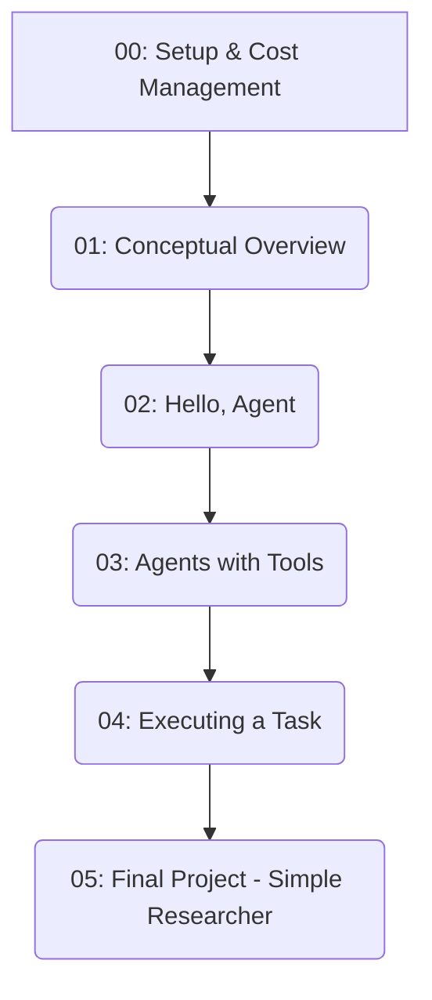

# Agent Concepts Primer

Welcome to the Agent Concepts Primer! This repository is a hands-on, step-by-step introduction to the core concepts of AI agent development. 

## The Philosophy: A Disposable Learning Vehicle

The world of Agent Development Kits (ADKs) is fast-moving and volatile. Today's hot framework can become tomorrow's legacy code. Therefore, this module is designed as a **disposable learning vehicle**. 

Our goal is *not* to make you an expert in one specific tool (we use LangChain here). Instead, we use a popular ADK as a practical, concrete example to help you grasp the fundamental, durable concepts that apply across all agentic systems:

- **Agents**: The core logic that uses an LLM to reason and make decisions.
- **Tools**: The functions and APIs that give an agent capabilities beyond text generation.
- **Reasoning Loops**: The process by which an agent decides which tool to use (if any) to answer a query.
- **Memory**: How an agent can remember previous interactions.

By focusing on these concepts, you will gain transferable knowledge that remains valuable regardless of which framework you use in the future.

## Learning Path

This repository is structured as a series of notebooks. You should proceed through them in order to build your understanding from the ground up.



## Getting Started

1.  **Clone the repository:**
    ```bash
    git clone https://github.com/aastom/agent-concepts-primer.git
    cd agent-concepts-primer
    ```

2.  **Set up a virtual environment:**
    ```bash
    python -m venv .venv
    source .venv/bin/activate # On Windows use ` .venv\Scripts\activate `
    ```

3.  **Install dependencies:**
    ```bash
    pip install -r requirements.txt
    ```

4.  **Set up your environment variables:**
    -   Copy the `.env.example` file to a new file named `.env`.
    -   Add your API keys to the `.env` file. See `notebooks/00_Setup_and_Cost_Management.ipynb` for detailed instructions.

5.  **Launch Jupyter Lab:**
    ```bash
    jupyter lab
    ```

Now, open the `notebooks` directory and start with the first notebook!

---

<aside>
    
⚠️ **A Note on API Costs**

Running AI agents involves making calls to powerful Large Language Models (LLMs), which is a paid service. This module is designed to use low-cost models by default to minimize expenses, but costs can add up if you are not careful. The `00_Setup_and_Cost_Management.ipynb` notebook provides critical information on managing these costs. Please read it carefully before running the examples.

</aside>
